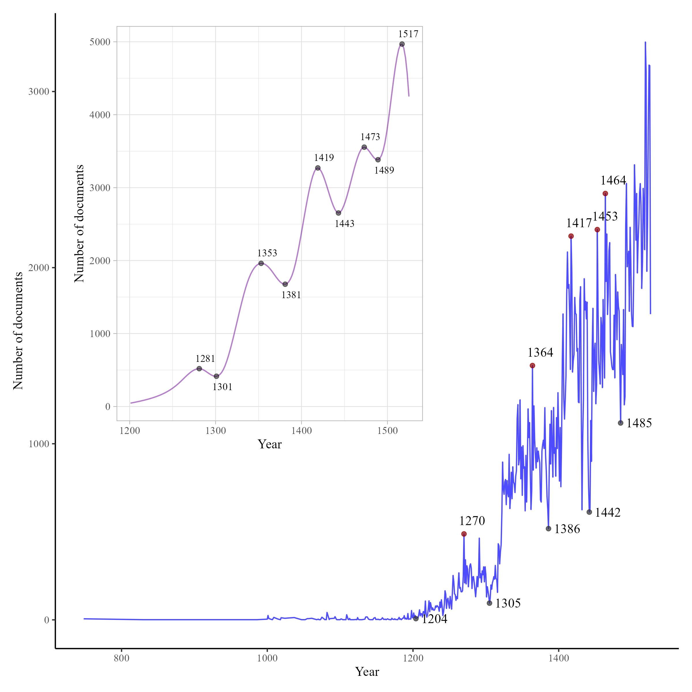
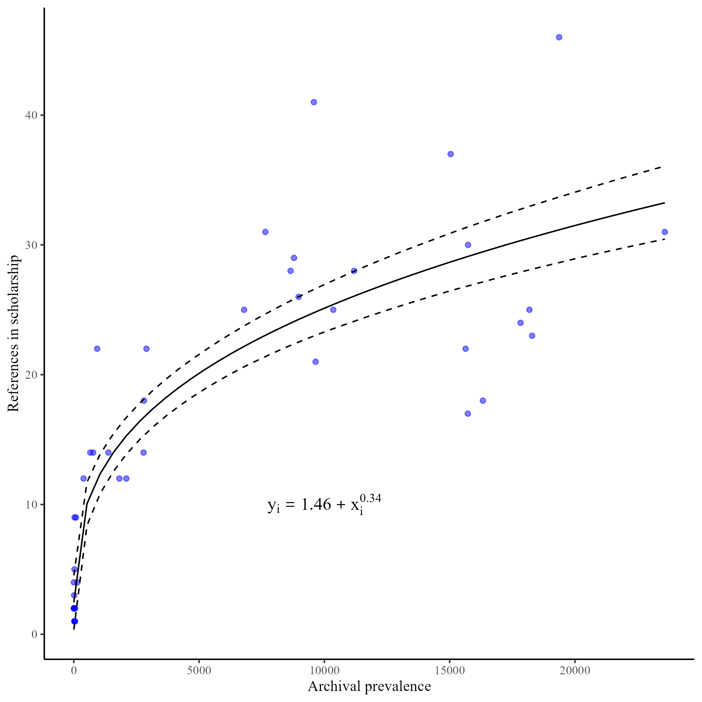
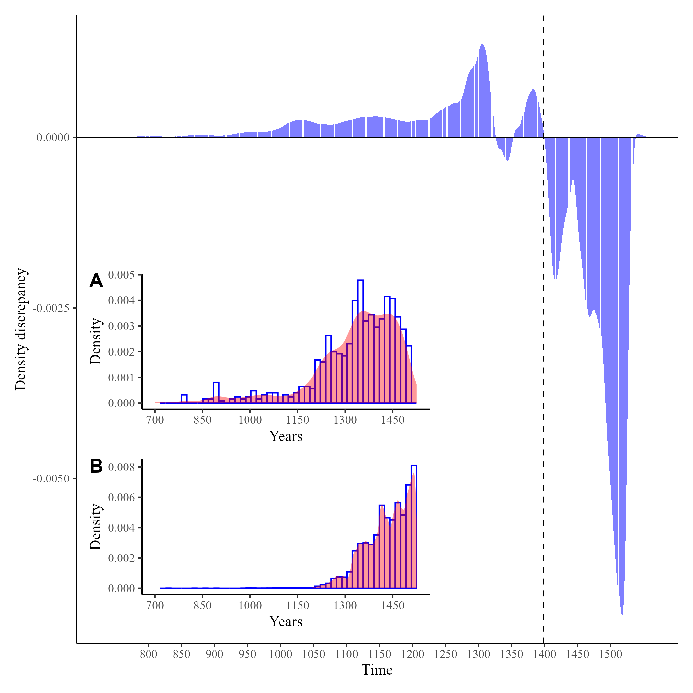

# Quantitative Analysis of the Pre-Mohács Collection at the Hungarian National Archives: Epistemic Implications and Research Potential
 This repository contains code for scraping data and replicating the analysis for a forthcoming paper that analyzes the metadata of approximately 318,000 documents held in the medieval collection of the Hungarian National Archives.
 ## Abstract
The paper examines the content of the entire pre-Mohács collection of the Hungarian National Archives, as well as the implications of the availability of sources for research and the construction of historical knowledge. Results reveal issues with metadata, highlight artifacts of political processes in the frequencies of extant documentation, and show the exponential growth in the number of sources over time. Models of the prevalence of particular periods in scholarship suggest a relative underexploration of history after the mid-1300s and an overexploration of the earlier period.

<ul>

  <li>
    <h4>Number of documents grows exponentially with time.</h4>
     
    
<em>Distribution of documents across time, highlighting key inflection points where the frequency of documentation changes.</em>

  </li>

  <li>
    <h4>The relationship between the frequency of periods in archival sources and in scholarship is sublinear.</h4>
     
    
<em>Estimated relationship between archival and scholarly prevalence of years.</em>

  </li>

  <li>
    <h4>This indicates that earlier periods are relatively over-researched, while later periods are relatively under-researched.</h4>
     
    
<em>The density discrepancy between years reported in scholarship and archival sources. The inset shows the density in A) scholarship and B) the archives.</em>

  </li>

</ul>

## Contact
 For any questions or further discussions, please contact Davor Salihović at [davor.salihovic@gmail.com] or [davor.salihovic@uantwerpen.be].

